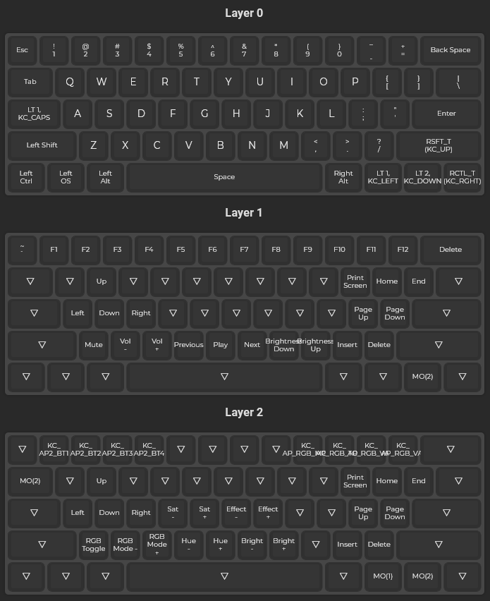

# Custom QMK keymap

This is my QMK keymap for a modded Anne Pro 2 keyboard.

Use it by downloading the compiled binary from the GitHub Action and then flashing it onto the keyboard with [Anne Pro 2 Tools](https://github.com/OpenAnnePro/AnnePro2-Tools).

To get RGB matrix effects from QMK to work, you will need the [Anne Pro 2 Shine firmware](https://github.com/OpenAnnePro/AnnePro2-Shine) to flash with the Anne Pro 2 Tools.

## Keymap as image

